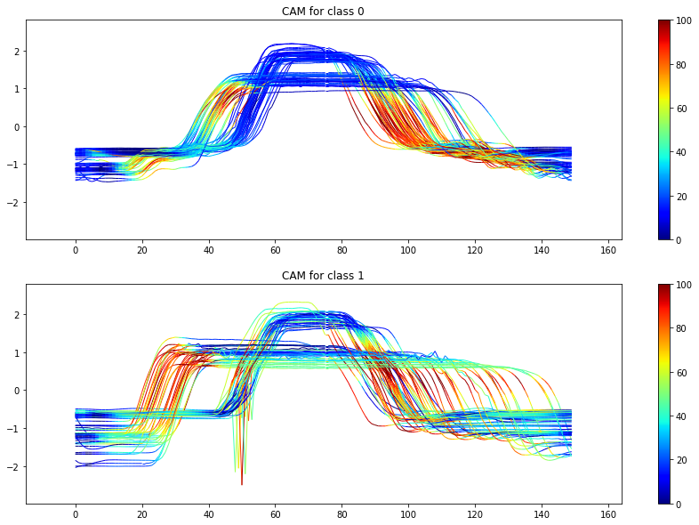
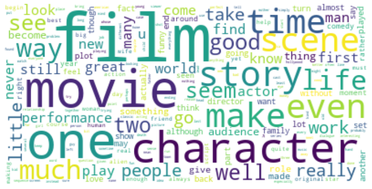

# Data Science Portfolio
A portfolio with some of my data science projects created for academic courses, self-learning and hobby. For some of my professional data science work please refer to the following links:
- [Personal profile page at ZHAW](https://www.zhaw.ch/en/about-us/person/kuzn/)
- [Project poster: "Ecological and economic process optimization in cement production through machine learning"](https://digitalcollection.zhaw.ch/bitstream/11475/26666/3/2023_Bolt-etal_Vigier-Projekt_Datalab-Symposium-Poster.pdf)
- [Case study on using Python with OPC DA](https://opcexpert.com/case-studies/rest-api-python-ciments-vigier)

**NOTE:**  The projects displayed here use jupyter notebooks. In case of github having troubles displaying the notebooks just use the [nbviewer](https://nbviewer.jupyter.org/) of jupyter.

# [Project 1: Time Series Classification with Deep Learning](https://github.com/raffaelk/DL_Timeseries_Classification) 

## Content
- Used deep learning to classify time series data.
- Applied a transformer model to time series and compared it to two different convolutional networks.
- Created class activation maps (CAM) to highlight features learned by the convolutional networks.
- Visualized the attention values of the transformer model.

## Main Technologies Used

- Language: Python
- Visualization: Matplotlib
- Analysis and Modelling: PyTorch, NumPy

# [Project 2: Sentiment Classification of Movie Reviews & Deployment with Docker](https://github.com/raffaelk/nlp-basics/tree/main/sentiment_classification)

## Content
- Created a NLP model for sentiment classification of movie reviews.
- Compared a lexicon based approached to a discriminative classifier.
- Built a simple application to test the prediction models in a web browser.
- Using docker compose, REST-APIs and a MySQL database to deploy the application.

## Main Technologies Used
- Language: Python 
- Visualization: Matplotlib, wordcloud
- Analysis and Modelling: pandas, scikit-learn, NLTK
- Deployment: Flask, SQL, HTML, Docker
- Set-Up: Bash

# [Project 3: Topic Classification and Analysis of Newspaper Headlines](https://github.com/raffaelk/nlp-basics/tree/main/topic_classification)

## Content
- NLP analysis of a set of newspaper headlines.
- Performed an extended exploratory data analysis.
- Displayed with graphical and statistical tools how the importance of certain topics and words evolved over time.
- Created a multiclass classification model to classify the headlines into distinct topic categories. 

## Main Technologies Used
- Language: Python 
- Visualization: Matplotlib, Seaborn
- Analysis and Modelling: pandas, scikit-learn, NLTK

# [Project 4: House Price Prediction with Scikit-Learn and Spark](https://github.com/raffaelk/ames_regression)

## Content
- Set up a simple machine learning pipeline to predict house prices.
- Compared the big data framework Apache Spark to scikit-learn.

## Main Technologies Used
- Language: Python 
- ML Pipeline: scikit-learn, PySpark

